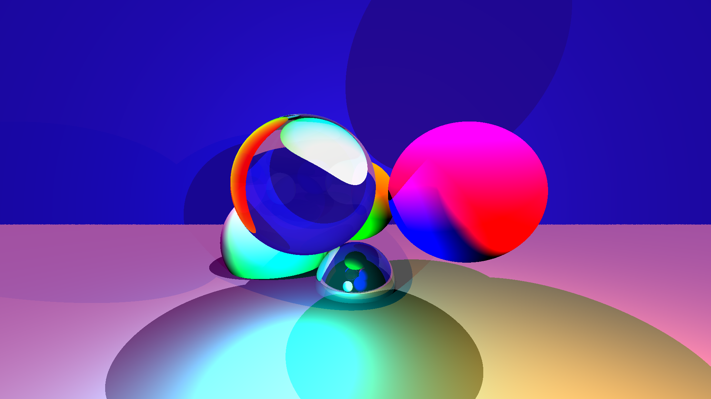

[![Build status on GitLab CI][gitlab-ci-master-badge]][gitlab-ci-link]

[gitlab-ci-link]: https://gitlab.com/timvisee/raytrace-rs/pipelines
[gitlab-ci-master-badge]: https://gitlab.com/timvisee/raytrace-rs/badges/master/pipeline.svg

# Ray Tracer in Rust
A [Whitted][wikipedia] style ray tracer written in Rust.

This program loads a scene from a YAML file, and renders it to an image file.




I've heavily used [Scratchapixel][scratchapixel] as resource for an ray tracer
implementation.

## Usage
Make sure you have `git` and Rust (through [rustup][rustup] installed).

```bash
# Clone git repository
git clone https://github.com/timvisee/raytrace-rs.git
cd raytrace-rs

# Create release build
cargo build --release

# Render and open sample scene
./target/release/raytrace-rs scenes/balls.yml render.png --open
```

## License
This project is released under the GNU GPL-3.0 license.
Check out the [LICENSE](LICENSE) file for more information.

[rustup]: https://rustup.rs/
[scratchapixel]: https://www.scratchapixel.com/
[wikipedia]: https://en.wikipedia.org/wiki/Ray_tracing_(graphics)
